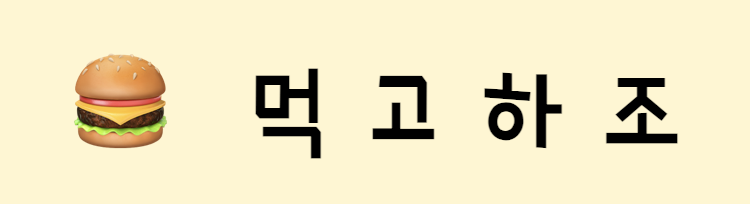
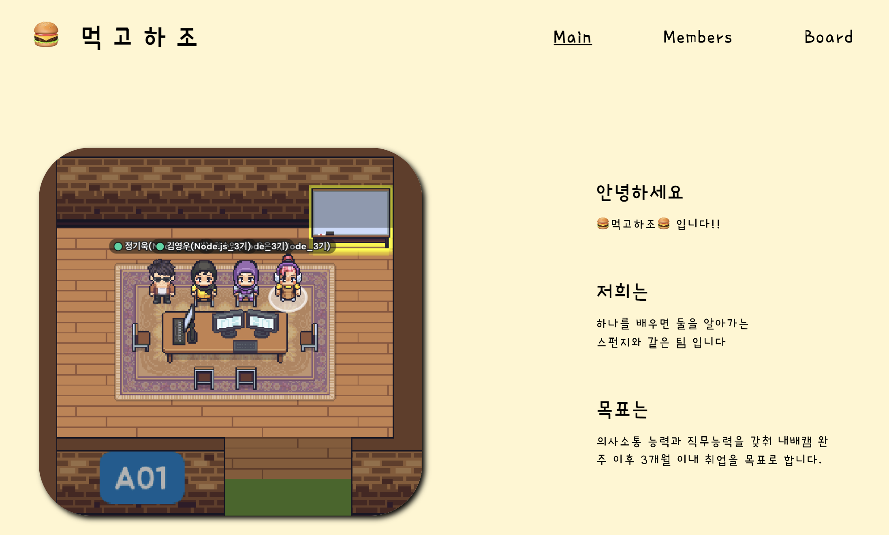
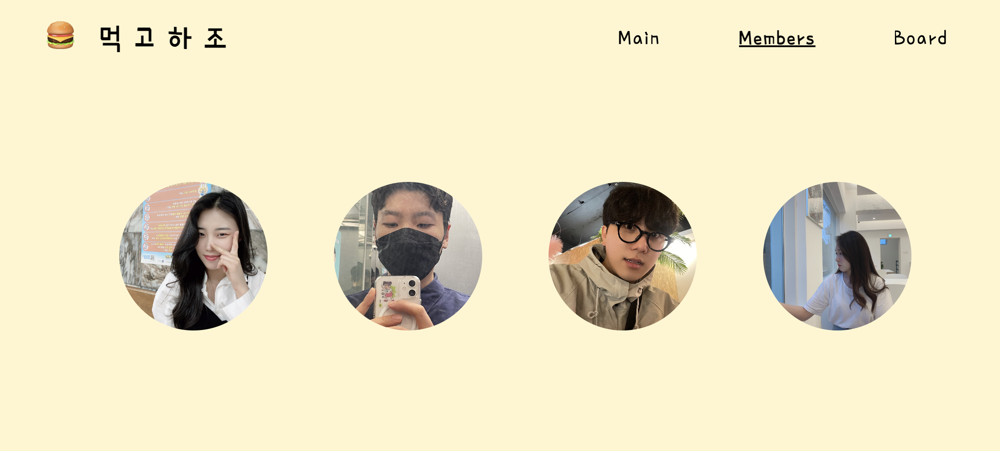
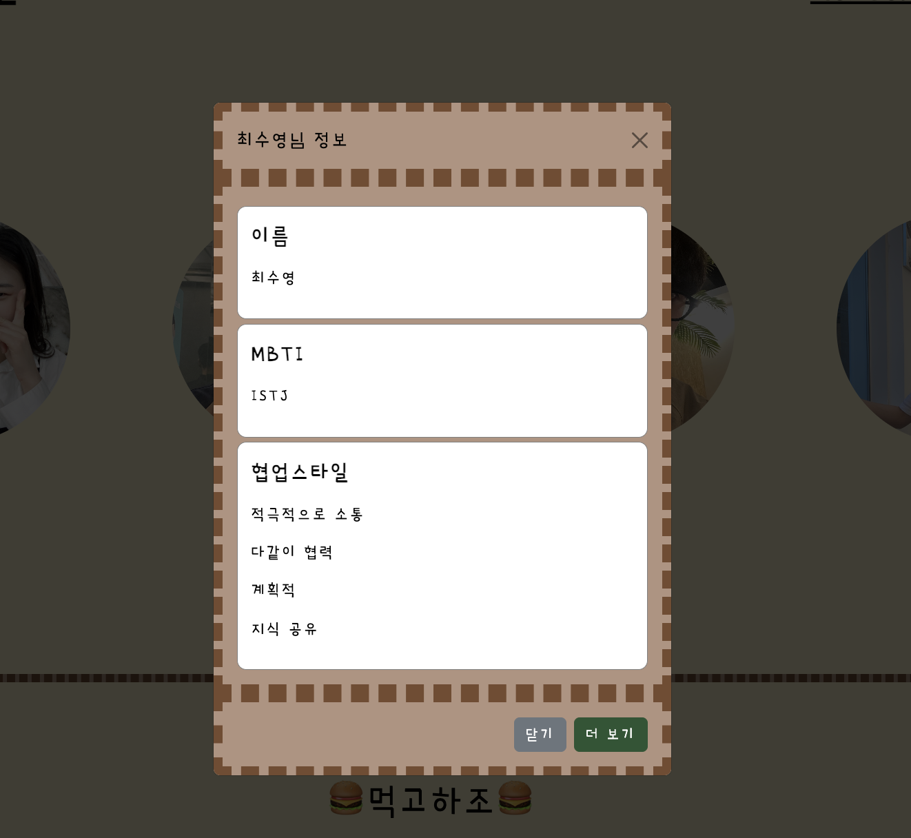
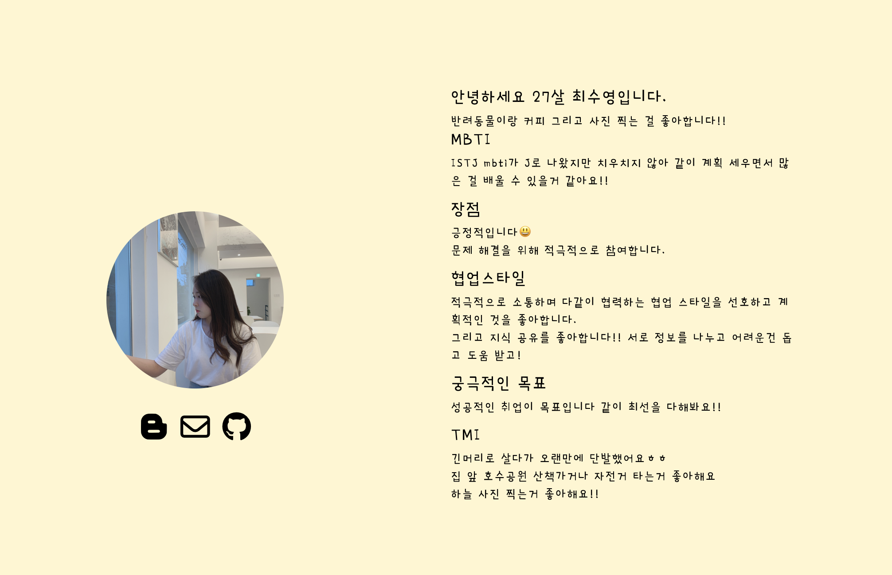
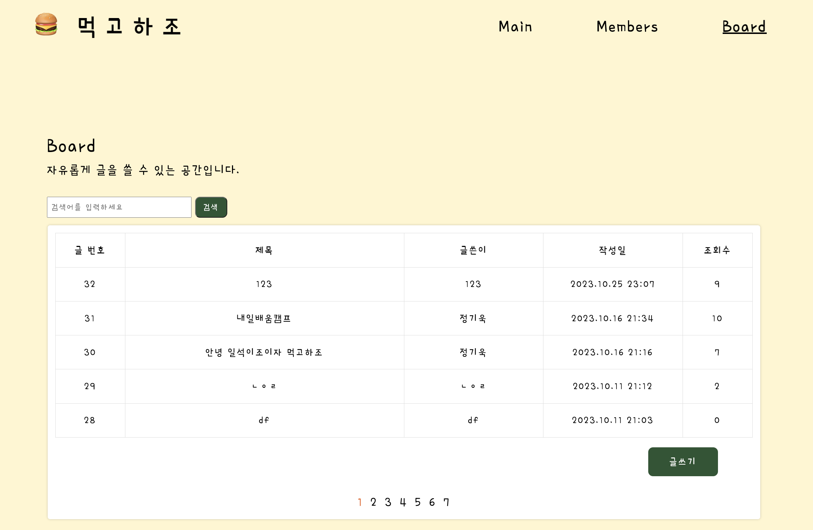
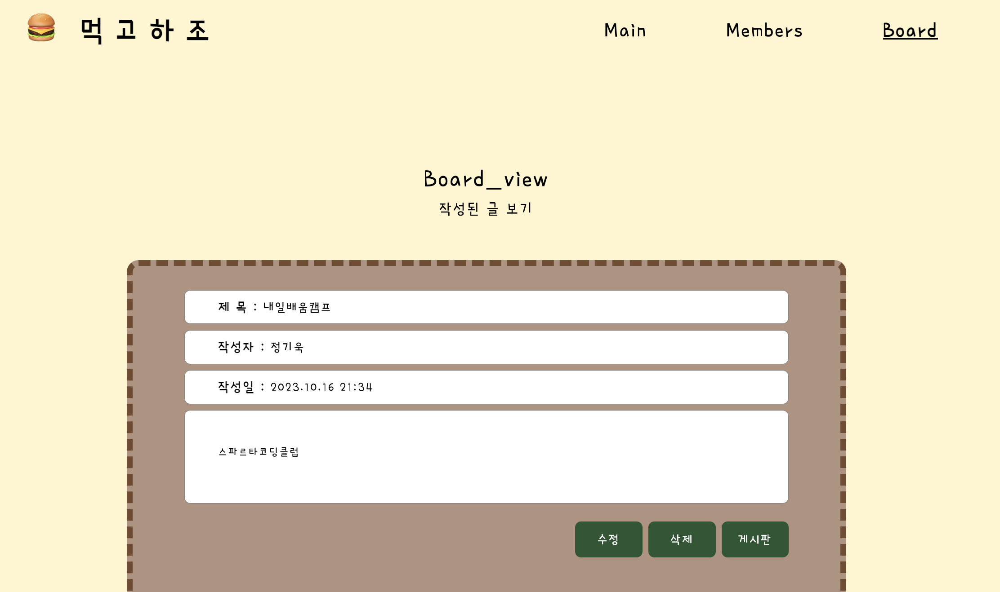
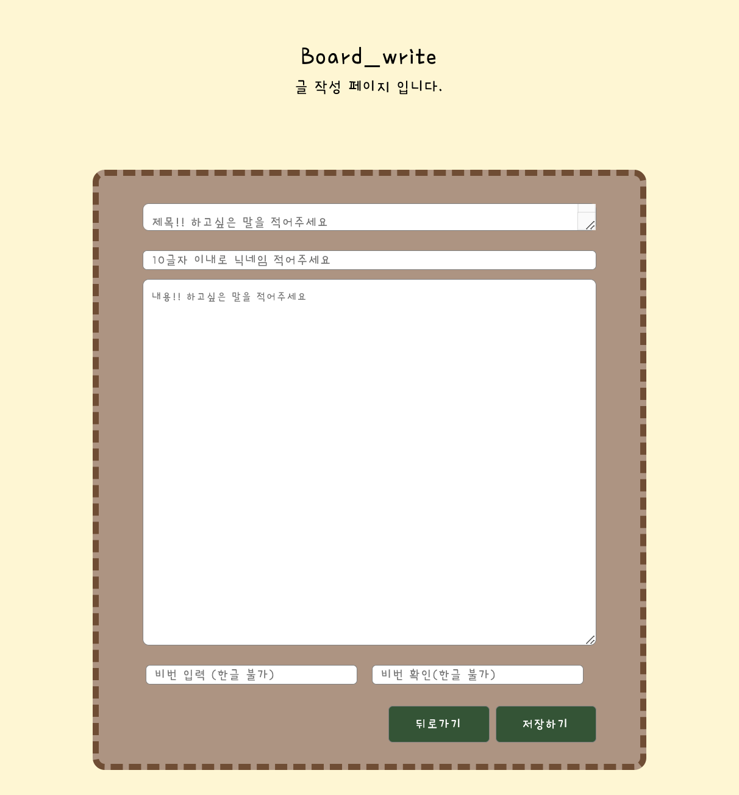

# 🍔 먹고하조 프로젝트

## 페이지 링크 및 소개

- 사진 클릭시 사이트로 이동합니다.
- 팀 소개 페이지입니다.
- 4명에서 진행되었습니다.
- 팀 소개 페이지와 각 멤버별 소개 페이지 그리고 방명록 게시판으로 구성되어있습니다.

 
 

# 👥 팀원 소개

<table>
  <tbody>
    <tr align="center">
      <td align="center"></td>
      <td align="center"></td>
      <td align="center"></td>
      <td align="center"></td>
    </tr>
    <tr align="center">
  </tr>
  <tr align="center">
  <td width="300"><a href="https://github.com/YoungOops">김영우</td>
  <td width="300"><a href="https://github.com/eunji624">유은지</a></td>
  <td width="300"><a href="https://github.com/heyfuxkingcheez">정기욱</a></td>
  <td width="300"><a href="https://github.com/choisooyoung-dev">최수영</a></td>
  </tr>
     <tr height="200">
    <td>
    - 메인페이지 프론트 
    - 계좌이체 가능한 큐알코드 페이지 
    - 멤버 소개 상세페이지 메일 연결 기능 
    - 게시물 수정
    </td>
    <td>
    - 게시판작성 페이지 프론트 
    - 멤버 사진 모달창 구현 
    - 상세보기 클릭시 해당 좌표 이동 
    - 파이어 베이스 연결 
    - 게시물 삭제
     
    </td>
    <td>
      - 게시판 페이지 프론트 
      - navbar 
      - 파이어 베이스 연결 
      - 댓글 기능 
      - 게시물 생성
    </td>
    <td>
      - 멤버 페이지 프론트 
      - 멤버 사진 모달창 구현 
      - 클래스 명 정리, css 정리 
      - favicon 삽입 
      - 게시물 조회 
      - 페이지네이션
    </td>
  </tr>
  </tbody>
</table>

 
 

# 🛠️ 기술 스택

    
    
    
    

 
 

# ✨ 기능

## 메인 페이지

</img>

## 멤버 페이지

</img>

## 멤버 모달창

- 더보기 클릭시 상세페이지에 해당 멤버 좌표로 이동합니다.
   

</img>

## 멤버 상세 페이지

</img>

## 게시판

- 전체 게시글을 조회할 수 있습니다.
- 페이지네이션 적용하였습니다.
- 제목으로 글을 검색할 수 있습니다.
   

</img>

## 게시판 상세 페이지

- 수정, 삭제시 비밀번호 확인 후 가능합니다.
   

</img>

## 게시글 추가 페이지

- 비밀번호와 확인비밀번호가 일치해야합니다.
   

</img>
